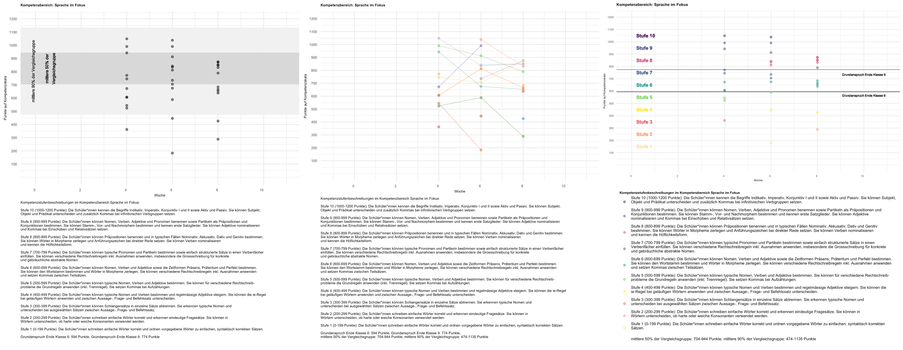

class: center,  middle, hide_logo


<head>
<script src="https://kit.fontawesome.com/994a28441d.js" crossorigin="anonymous"></script>
</head>

<!--<div class="my-footer"><span>Folien CC-BY verfügbar unter https://atelier-phka-merk-2020.netlify.app</span></div> 


<style>
.remark-slide-number {
  font-size: 10pt;
  margin-bottom: -11.6px;
  margin-right: 10px;
  color: red; /* white */
  opacity: 0; /* default: 0.5 */
}
</style>
--> 

```{r xaringan-themer, echo=F, warning=FALSE}
library(xaringanthemer)
library(fontawesome)
library(xaringanExtra)

extra_css <- list(
  ".cit"  = list("font-size" = "70%",
                 "color" = "#6AEE3E90"),
  ".em05" = list("font-size" ="0.5em"),
  ".em06" = list("font-size" ="0.6em"),
  ".em07" = list("font-size" ="0.7em"),
  ".em08" = list("font-size" ="0.8em"),
  ".em09" = list("font-size" ="0.9em"),
  ".em11" = list("font-size" ="1.1em"),
  ".em12" = list("font-size" ="1.2em"),
  ".em13" = list("font-size" ="1.3em"),
  ".em14" = list("font-size" ="1.4em"),
  ".em15" = list("font-size" ="1.5em"),
  ".em16" = list("font-size" ="1.6em"),
  ".em17" = list("font-size" ="1.7em"),
  ".em18" = list("font-size" ="1.8em"),
  ".em19" = list("font-size" ="1.9em"),
  ".bold" = list("font-weight" = "bold"),
  ".large" = list("font-size" = "160%"),
  ".vertmiddle" = list("vertical-align" ="middle"),
  #".lh15" = list("line-height" =  "1.5"),
  ".li" = list("line-height" =  "1.5",
               "font-size" = "160%",
               "font-weight" = "bold"),
  ".phgreen" = list("color" = "#50B32E"),
  ".phgreenlight" = list("color" = "#62DC3A"),
  ".pgl" = list("color" = "#62DC3A"),
  ".phg" = list("color" = "#8cd000"),
 # ".my-footer" = list("background-color" = "#1a1917",
 #                     "position" = "absolute",
 #                     "bottom" = "0px",
 #                     "left" = "0px",
 #                     "height" = "20px",
 #                     "width" = "100%"),
  ".my-footer span" = list("font-size" = "10pt", 
                           "color" = "#F7F8FA",
                           "position" = "absolute",
                           "left" = "15px",
                           "bottom" = "2px"),
  ".remark-slide-number" = list("bottom" = "-18px"),
  ".li" = list("line-height" =  "4"),
  ".scroll-box-18" = list("height" ="18em",
                           "overflow-y" = "scroll"),
  ".scroll-box-23" = list("height" ="23em",
                           "overflow-y" = "scroll"),
  ".hscroll-box-30" = list("width" ="23em",
                           "overflow-x" = "scroll"))

style_mono_accent_inverse(
  base_color = "#8cd000",
  white_color = "#FFFFFF",
  black_color = "#272822",
  extra_css = extra_css)

library(xaringanExtra)
use_logo(
  image_url = "https://apps.samuel-merk.de/data/PHK_2018_Logo_V1_FARBE_NUR_PH.svg",
  width = "80px",
  position = xaringanExtra::css_position(top = "1em", right = "1em")
)
```


.phg[
# Vorlesung:

<i class="fas fa-microscope fa-7x"></i>

### Qualitative und quantitative Forschungsmethoden

---  
.em14[Samuel Merk | PH Karlsruhe]]  


---
# Was habe ich heute vor?
.em14[
* Vertiefung der Begriffe
* Übertragung auf das Experiment
* Probleme bei Fragebögen und wie man Sie vermeidet
* Ihre Fragen zu Video & Aufgaben
]

---
# Vertiefung der Begriffe
```{r, echo = F, message=FALSE, fig.align='center', warning=FALSE, fig.width=14, cache = T}
library(tidyverse)
library(highcharter)
library(viridisLite)
hchart(
  tibble(
  word = sample(c("Messung ", "messen ", "Reliabilität ", "Durchführungsobjektivität ",
                  "Kriteriumsvalidität ", "Konstruktvalidität ", "Interpretationsobjektivität ",
                  "Homomorphismus ", "Item ",
                  "Unipolarität ", "Likertitem ", "Anker "), 30, replace = T),
  freq = sample(1:50, 30, replace = T)),
  "wordcloud",
  hcaes(name = word, weight = log(freq)),
  ) %>% 
   hc_colors("#8CD00095")

```

---
## Beispielstudie: *Elicitations from the Gender Star Form*
### Körner et al (2022); Pressemitteilung https://bit.ly/merk021
Körner, A., Abraham, B., Rummer, R., & Strack, F. (2022). Gender Representations Elicited by the Gender Star Form. Journal of Language and Social Psychology, 0261927X2210801. https://doi.org/10.1177/0261927X221080181

<center>
<iframe id="frame01" src='https://www.uni-kassel.de/uni/aktuelles/meldung/2022/03/2/psycholinguistik-das-gender-sternchen-laesst-uns-bevorzugt-an-frauen-denken?cHash=0b83861f337f2eb6e520fd33b0b7d4d3'></iframe>
</center>
<style>
#frame01{ height: 330px; width: 1200px; align: center; overflow: scroll;}
</style>

---
## Körner et al (2022)

<embed src="Korner_et_al_2022.pdf" width="500" height="1200" 
 type="application/pdf">


---
class: middle center hide_logo

Uns interessiert, welche Verbindungen von Sätzen als sinnvoll eingeschätzt werden. 
Dazu bekommen Sie von uns zwei Sätze und Sie sollen jedes Mal beurteilen, ob der zweite Satz eine sinnvolle Fortsetzung des ersten sein könnte.

In den Sätzen wird es um Gruppen von Menschen gehen. Wir verwenden dabei die maskuline Pluralform (z.B. die Berater); damit sind sowohl Frauen als auch Männer gemeint. 

Genauer gesagt sehen Sie erst den ersten Satz. Wenn Sie diesen gelesen haben, drücken Sie bitte die Leertaste. 
Dann sehen Sie den zweiten Satz. Wenn Sie denken, dass dieser Satz als Fortsetzung sinnvoll ist, drücken sie **j**, wenn nicht, drücken Sie **f**. 


---
class: middle center hide_logo

.em12[Die Kellner liefen durch den Bahnhof.]

.phg[.em08[Drücken Sie die Leertaste, wenn Sie den Satz gelesen haben.]]

---
class: middle center

.em12[Es war offensichtlich, dass die meisten Frauen gut gelaunt waren.]
.phg[.em08[Wenn Sie denken, dass dieser Satz als Fortsetzung sinnvoll ist, drücken sie **j**, wenn nicht, drücken Sie **f**.]]

---
class: middle center hide_logo

.em12[Die Mütter warteten am Rathaus.]

.phg[.em08[Drücken Sie die Leertaste, wenn Sie den Satz gelesen haben.]]

---
class: middle center

.em12[Wegen des bewölkten Wetters trug eine der Frauen einen Regenschirm.]

.phg[.em08[Wenn Sie denken, dass dieser Satz als Fortsetzung sinnvoll ist, drücken sie **j**, wenn nicht, drücken Sie **f**.]]


<!-- Jetzt Sternchenform --><!-- Jetzt Sternchenform --><!-- Jetzt Sternchenform -->

---
class: middle center hide_logo

Uns interessiert, welche Verbindungen von Sätzen als sinnvoll eingeschätzt werden. 
Dazu bekommen Sie von uns zwei Sätze und Sie sollen jedes Mal beurteilen, ob der zweite Satz eine sinnvolle Fortsetzung des ersten sein könnte.

In den Sätzen wird es um Gruppen von Menschen gehen. Wir verwenden dabei die genderneutrale Pluralform (z.B. die Berater*innen); damit sind sowohl Frauen als auch Männer gemeint.

Genauer gesagt sehen Sie erst den ersten Satz. Wenn Sie diesen gelesen haben, drücken Sie bitte die Leertaste. 
Dann sehen Sie den zweiten Satz. Wenn Sie denken, dass dieser Satz als Fortsetzung sinnvoll ist, drücken sie **j**, wenn nicht, drücken Sie **f**. 

---
class: middle center hide_logo

.em12[Die Kellner*innen liefen durch den Bahnhof.]

.phg[.em08[Drücken Sie die Leertaste, wenn Sie den Satz gelesen haben.]]

---
class: middle center

.em12[Es war offensichtlich, dass die meisten Frauen gut gelaunt waren.]

.phg[.em08[Wenn Sie denken, dass dieser Satz als Fortsetzung sinnvoll ist, drücken sie *j*, wenn nicht, drücken Sie *f*.]]
---
class: middle center hide_logo

.em12[Die Mütter warteten am Rathaus.]

.phg[.em08[Drücken Sie die Leertaste, wenn Sie den Satz gelesen haben.]]

---
class: middle center

.em12[Wegen des bewölkten Wetters trug eine der Frauen einen Regenschirm.]  

.phg[.em08[Wenn Sie denken, dass dieser Satz als Fortsetzung sinnvoll ist, drücken sie *j*, wenn nicht, drücken Sie *f*.]]


---
## Verständnisrückfragen zum Experiment?

## Wenden Sie die Begriffe auf das Experiment an:

* Was steigert die Objektivität, was senkt sie?
* Wie kann die Reliabilität in diesem Fall gesteigert werden?
* Was bedeutet Konstruktvalidität in diesem Fall?
   * Was genau wird gemessen?
   * Wie werden diese Messwerte interpretiert?
   * Ist diese Interpretation angemessen?
   
---
## Anwendung auf Kontext Notengebung
* Was bedeuten hier 
    * Objektivität
    * Reliabilität
    * Konstruktvalidität?
    
---
## Notengebung als Messung & Bezugsnormen (Experiment)

### Bezugsnormen
<br><br><br><br><br><br><br>


--
### Forschungsfrage des Experiments:
> Kann man mit verschiedenen grafischen Darstellungen die Bezugsnormorientierung beeinflussen?

    
    
---
## Unabhängige Variable: Darstellung der Daten
```{r, echo = F, out.width="100%"}

```


---
## Abhängige Variable: Präferierte Aussage
* "Die Schüler_innen schneiden besser als die Vergleichsgruppe ab."
* "Manche Schüler_innen haben sich verbessert, andere haben sich verschlechtert."
* "Die meisten Schüler_innen erreichen die Kompetenzstufe 8 und höher bzw. liegen über dem Grundanspruch für das Ende der 9. Klasse."

---
## Ergebnis

Welche Klasse angezeigt wurde ergibt sich aus `ref_norm` und star


```{r, echo = F}
library(tidyverse)
library(knitr)
data <- read_csv("BNO_data.csv") %>% 
  filter(substr(code, 1, 1) %in% c("1","2","3","4","5","6","7","8","9")) %>% 
  mutate(union_random_refnorm_sentence_t2 = 
           case_when(is.na(random_refnorm_sentence_t2_class1) ~ random_refnorm_sentence_t2_class2,
                     TRUE ~ random_refnorm_sentence_t2_class1),
         refnorm_seconddata_firstchoice = 
           case_when(substr(union_random_refnorm_sentence_t2, 1, 6) == 
                       "Manche" ~ "ind.",
                     substr(union_random_refnorm_sentence_t2, 1, 11) == 
                       "Die meisten" ~ "krit.",
                     substr(union_random_refnorm_sentence_t2, 1, 8) == 
                       "Die Schü" ~ "soz."),
          refnorm_seconddata_secondchoice = 
           case_when(substr(sub(".*-(.*)-.*","\\1", union_random_refnorm_sentence_t2), 1, 6) == 
                       "Manche" ~ "ind.",
                     substr(sub(".*-(.*)-.*","\\1", union_random_refnorm_sentence_t2), 1, 11) == 
                       "Die meisten" ~ "krit.",
                     substr(sub(".*-(.*)-.*","\\1", union_random_refnorm_sentence_t2), 1, 8) == 
                       "Die Schü" ~ "soz."),
         refnorm_seconddata_thirdchoice = 
           case_when(paste(refnorm_seconddata_secondchoice, 
                           refnorm_seconddata_firstchoice, sep = "") %in% 
                       c("ind.soz.", "soz.ind.") ~ "krit.",
                     paste(refnorm_seconddata_secondchoice, 
                           refnorm_seconddata_firstchoice, sep = "") %in% 
                       c("krit.soz.", "soz.krit.") ~ "ind.",
                     paste(refnorm_seconddata_secondchoice, 
                           refnorm_seconddata_firstchoice, sep = "") %in% 
                       c("ind.krit.", "krit.ind.") ~ "soz."),
         selected_refnorm = 
           case_when(refnorm_rank_t2 == 1 ~ refnorm_seconddata_firstchoice,
                     refnorm_rank_t2 == 2 ~ refnorm_seconddata_secondchoice,
                     refnorm_rank_t2 == 3 ~ refnorm_seconddata_thirdchoice)) 

kable(table(data$ref_norm, data$selected_refnorm))

DescTools::CramerV(table(data$ref_norm, data$selected_refnorm))

BayesFactor::contingencyTableBF(table(data$ref_norm, data$selected_refnorm),
                                sampleType = "poisson")
```


---
# Ihre Fragen <i class="far fa-question-circle"></i>
Stellen Sie Ihre Fragen zu Video/Aufgaben unter http://bit.ly/merk006 und voten Sie die Fragen Ihrer Kommiliton*innen.

---
# Literatur
Röhner, J., & Schütz, A. (2020). Impliziter Assoziationstest (IAT). In M. Wirtz (Hrsg.), Dorsch—Lexikon der Psychologie (S. 813). Hogrefe.
